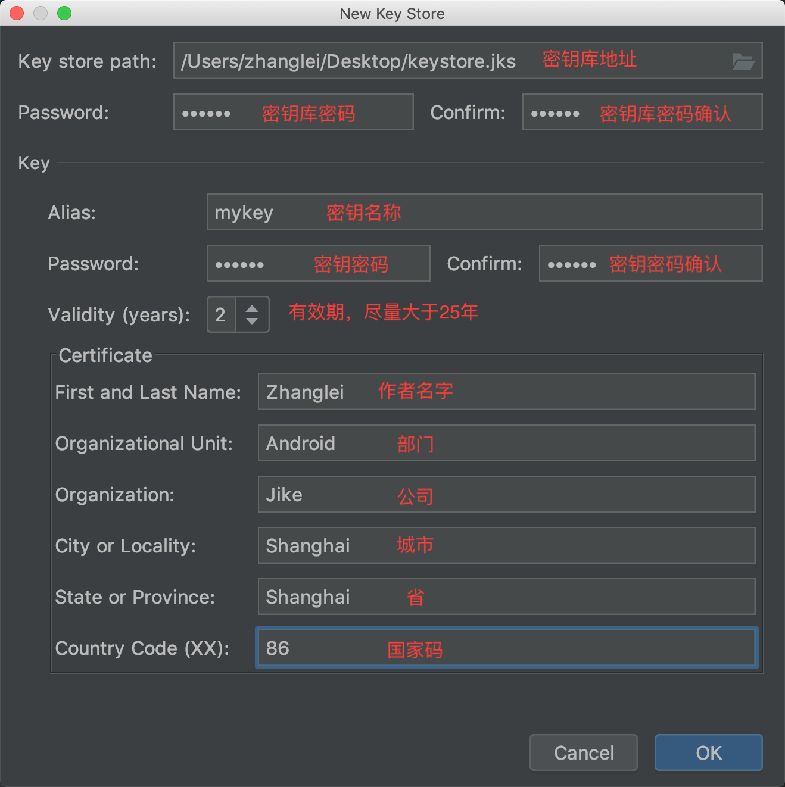
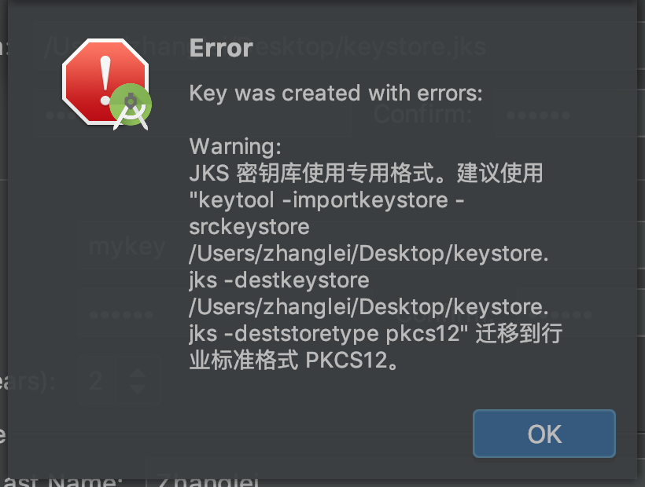

### apk 签名简明教程

关于 apk 签名官网解释的很详细，但太啰嗦了。本文提供一个简明教程，不讲为什么，只说怎么做。

#### 生成密钥库和密钥

AndroidStudio 里 `Build > Generate Signed Bundle / APK... > APK > Create new... `



点 OK 后出现一个 error：



不怕，按照他说的转换到 `pkcs12` 格式就好：

```shell
keytool -importkeystore -srckeystore /User/zhanglei/Desktop/keystore.jks -destkeystore /User/zhanglei/Desktop/keystore.jks -deststoretype pkcs12
```

#### 使用密钥

- 在项目配置文件 `gradle.properties` 中先定义四个变量：

    ``` properties
    STORE_FILE=/User/zhanglei/Desktop/keystore.jks
    STORE_PASSWORD=123456
    KEY_ALIAS=mykey
    KEY_PASSWORD=key123456
    ```

- 在 module 下的 build.gradle （`rootProject/app/build.gradle`）中：

    ``` groovy
    android {
        signingConfigs {
            mySignConfig { // 新增签名配置，名字随便起
                storeFile file(STORE_FILE) // 密钥库地址
                storePassword STORE_PASSWORD // 密钥库密码
                keyAlias KEY_ALIAS // 密钥名称
                keyPassword KEY_PASSWORD // 密钥密码
            }
        }
        
        defaultConfig {
            signingConfig signingConfigs.mySignConfig // 默认给所有渠道包(除 debug 外)签名
        }
        
        buildTypes {
            release {
                signingConfig signingConfigs.mySignConfig // 给 release 包签名
            }
            debug {
                signingConfig signingConfigs.mySignConfig // 给 debug 包签名
            }
            oppo {
                signingConfig signingConfigs.mySignConfig // 给 oppo 包签名
            }
            ...
        }
    }
    ```


