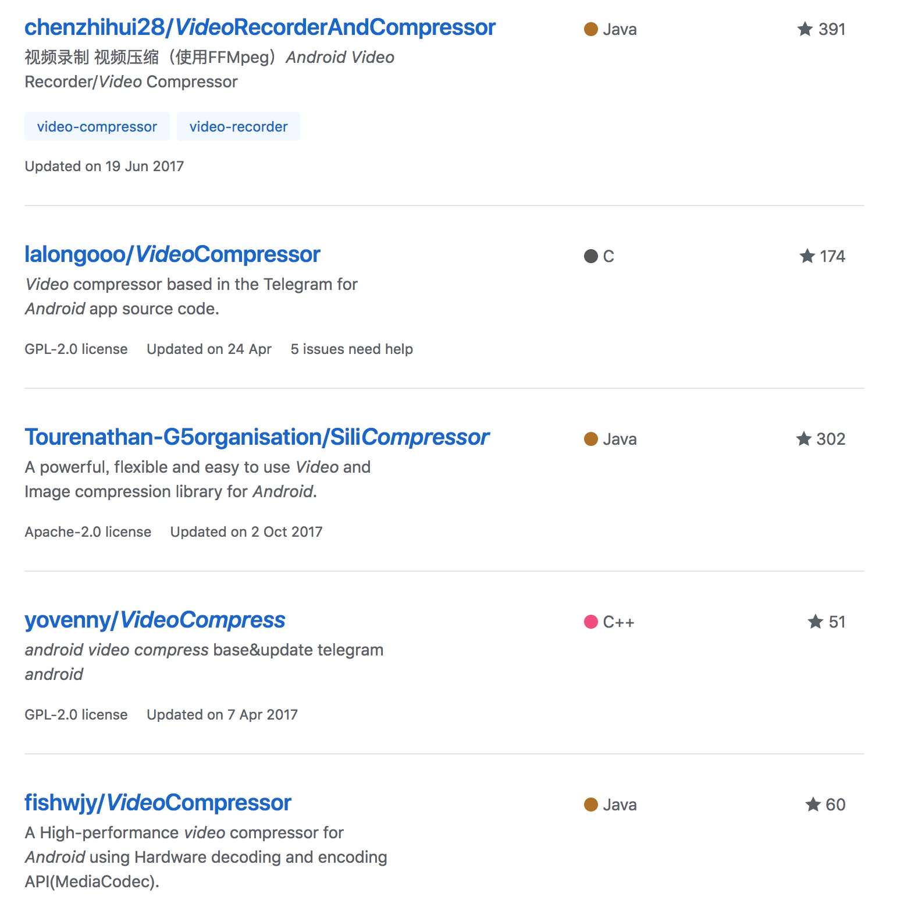
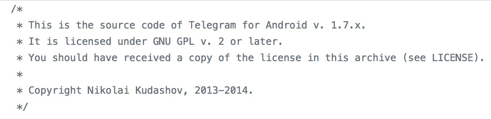

现在越来越多的app支持上传视频，但我们现在的设备录制的视频动辄就上百M，在上传视频之前必须对视频做压缩处理。比较常见的压缩办法是降低码率和降低分辨率。这两种方式都是对视频进行先解码再编码，降低分辨率是对解码后视频的每一帧的RGB/YUV像素数据做处理，而降低码率则是在编码这一步设置的。

通过查阅资料发现Android平台视频编解码有两种方式：

* MediaCodec
* FFMpeg+x264/openh264

第一种是Android sdk16开始支持的一套视频编解码API，属于硬解，好处是解码速度快，不需要第三方依赖。第二种基于FFMpeg属于软解，好处是通用性强，压缩率高。但属于第三方依赖，本身体积大，会大大增大apk体积。也可以通过jni方式仅继承FFMpeg中需要的依赖库，但需要学习JNI和FFMpeg源码，成本太大。所以现阶段采取硬解的方式，同时学习FFMpeg和JNI作为以后的优化方案。

既然确定了使用MediaCodec的方式压缩视频那就着手寻找一些范例代码或者项目学习一下。在github上输入"android video compress"出来如下结果:

排除了使用ffmpeg压缩的项目之后start数比较多就是Tourenathan-G5organisation/SiliCompressor这个项目，赶紧把这个项目下载到本地学习起来。视频压缩的主要逻辑在项目里的`SiliCompressor`类中，但说实话这个类维护的不太好，代码注释什么的都很随意。看到项目中有一个类时看到这么一行注释:

恍然大悟，原来这个项目是把 Telegram 中视频压缩的代码抽离出来作为一个项目开源，但在 README 文件中没有说明这一点，感觉有点不靠谱，而且把原来的代码改得面目全非。所以我就直接下载了 [Telegram For Android](https://github.com/DrKLO/Telegram) 学习起来。

Telegram 项目中负责视频压缩的代码在 `org.telegram.messenger.MediaController.convertVideo(final MessageObject messageObject)`方法中，吐槽一下这个方法有400多行看起来真的很累。视频文件一般由视频数据和音频数据组成，占大头的主要是视频数据，所以只要单独对视频文件做压缩就OK了。这个方法中也是这么做的，音频数据在处理完视频数据后再写入文件。这里只是简单的压缩处理，如果要进行视频播放速度的调整话那另说。

具体的处理流程如下：

### 引用
> [微信Android视频编码爬过的那些坑](https://github.com/WeMobileDev/article/blob/master/%E5%BE%AE%E4%BF%A1Android%E8%A7%86%E9%A2%91%E7%BC%96%E7%A0%81%E7%88%AC%E8%BF%87%E7%9A%84%E9%82%A3%E4%BA%9B%E5%9D%91.md)   
> [Telegram For Android](https://github.com/DrKLO/Telegram)
