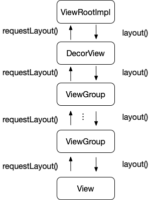

### View.requestLayout() 不生效的问题

View 的 requestLayout() 方法顾名思义用来触发一次 layout 行为，一般是当我们改变一些影响 View 布局的参数后调用，刷新 View 的布局。常见的使用方式如下：

``` kotlin
view.layoutParams.apply{
    width = 100
    height = 200
}
view.requestLayout()
```

要分析调用失效的原因，首先我们需要搞清楚 requestLayout() 流程。

#### requestLayout 调用流程

调用 requestLayout() 之后是如何开始一次 layout 的呢？我们看一下 requestLayout() 的源码：

``` java
public void requestLayout() {
    if (mMeasureCache != null) mMeasureCache.clear();

    if (mAttachInfo != null && mAttachInfo.mViewRequestingLayout == null) {
        // Only trigger request-during-layout logic if this is the view requesting it,
        // not the views in its parent hierarchy
        ViewRootImpl viewRoot = getViewRootImpl();
        if (viewRoot != null && viewRoot.isInLayout()) {
            if (!viewRoot.requestLayoutDuringLayout(this)) {
                return;
            }
        }
        mAttachInfo.mViewRequestingLayout = this;
    }

    mPrivateFlags |= PFLAG_FORCE_LAYOUT;
    mPrivateFlags |= PFLAG_INVALIDATED;

    if (mParent != null && !mParent.isLayoutRequested()) {
        mParent.requestLayout();
    }
    if (mAttachInfo != null && mAttachInfo.mViewRequestingLayout == this) {
        mAttachInfo.mViewRequestingLayout = null;
    }
}
```

这个方法逻辑比较简单，首先是将 MeasureCache 清掉，为即将开始的 layout 做准备。接下来一段代码根据注释应该是 request-during-layout 的逻辑，这部分我们先略过后面再讲。再下来的代码是这个方法的核心：设置绘制状态位和调用 parent 的 requestLayout。PFLAG\_FORCE\_LAYOUT 表示当前 View 需要 layout，可以理解为 View 当前的布局数据已经过期，需要下一次 layout pass 重新布局，PFLAG\_INVALIDATED 和 PFLAG\_FORCE\_LAYOUT 类似，只不过表示的是绘制数据。为什么要调用 parent 的 requestLayout() 这里稍微解释下，因为父 View 是包含着子 View 的，子 View 的布局一般决定着父 View 的布局，所以当子 View 布局发生改变时也要通知父 View 刷新自己的布局。通过一级一级向上调用最终调用到 ViewRootImpl 的 requestLayout() 方法，这个方法代码如下：

``` java
if (!mHandlingLayoutInLayoutRequest) {
    checkThread();
    mLayoutRequested = true;
    scheduleTraversals();
}
```

逻辑很简单，布局工作应该在 `scheduleTraversals()` 方法中完成，通过继续跟进调用关系，最终调到了 `performLayout()` 方法，在这个方法中调用的是 DecorView 的 layout() 方法，开始了我们熟悉的布局流程，自顶向下调用子 View 的 layout() 方法，和 requestLayout() 的调用方向刚好相反，如下图：



#### request-during-layout 处理

现在我们来看一下 View.requestLayout() 中刚才跳过的部分，这里通过 mAttachInfo.mViewRequestingLayout 变量来确定发起 requestLayout() 的 View，因为只有发起 View 能触发 request-during-layout 逻辑，它的祖先 Views 不可以，至于原因后面会讲到。

request-during-layout 从字面上看是当进行一次 layout pass 时，当前界面中有 View 调用 requestLayout()。代码中可以看到通过 `viewRoot.isInLayout()` 判断当前是否在 layout，然后调用 `ViewRootImpl.requestLayoutDuringLayout` 方法，我们继续看看这个方法：

``` java
...
if (!mLayoutRequesters.contains(view)) {
    mLayoutRequesters.add(view);
}
...
```

核心逻辑就上面这一句，将发起 View 添加在 ViewRootImpl 的 mLayoutRequesters 列表中。我们看看什么时候使用这个列表，通过查看代码发现使用的地方在 performLayout() 中，前一句代码是 `mInLayout = false` 说明是在上一次 layout pass 结束后处理这个列表。处理的逻辑也比较简单，先对这个列表进行过滤拿到有效的 View，然后再依次调用 requestLayout() 的方法。

所以 request-during-layout 的处理可以简单理解为将在 layout 过程中的 requestLayout() 调用延迟到当前 layout pass 结束时再调用，这样也就理解了为什么只有发起 View 需要触发 request-during-layout 逻辑。

#### requestLayout() 调用失效原因

根据 requestLayout() 的调用流程可以发现，如果由下到上的调用中断无法调到 ViewRootImpl.requestLayout() 的话就会导致无法刷新布局。通过查看源码我们发现调用父 View 的 requestLayout() 有两个条件 parent != null 和 !parent.isLayoutRequested()，如果 parent 为空说明当前 View 不在界面上，那也不需要刷新布局，这个条件是合理的。

另外一个条件表示 parent 已经调用过 requestLayout()，这个判断为了防止正在进行的布局没有结束时开始下一次布局。但如果我们确实需要刷新当前界面的布局该怎么办呢？没事，View 的设计者想到了这种情况，对应的解决方案就是上面的 request-during-layout 处理。

不过 request-during-layout 处理并不是万无一失的，它有两个漏洞还是会造成 requestLayout() 调用失效：

1. request-during-layout 的处理必须是在 View.isInLayout == true 时才能奏效，如果当前不在 layout pass 中而且 requestLayout() 调用链无法作用到 ViewRootImpl.requestLayout() 时调用还是会失效。我们前面有提到祖先 View.isLayoutRequested() == true 的情况就是当前界面在进行 layout，但这里却说 isInLayout == false，是不是和前面说的自相矛盾了？当然不是。首先我们先看看 View.isInLayout() 的代码:

	``` java
	public boolean isInLayout() {
        ViewRootImpl viewRoot = getViewRootImpl();
        return (viewRoot != null && viewRoot.isInLayout());
    }
	```
	
	可以看到 isInLayout() 依赖于 ViewRootImpl.isInLayout() 继续看看这个方法:

	 ``` java
	boolean isInLayout() {
        return mInLayout;
    }
	 ```
	 
	 而 `mInLayout = true` 仅在 ViewRootImpl.performLayout() 存在，换句话说只有这个方法触发的布局刷新才会令 View.isInLayout() == true，也就是说通过别的途径触发的布局刷新会导致这种 requestLayout() 调用失效。具体会有什么布局刷新调用不是通过 ViewRootImpl.performLayout() 发起的呢？目前遇到的一种是 RecyclerView 中滑动引起 itemView 布局刷新，具体来说是将界面外的 itemView 滑动到界面内时，调用栈如下:

	 ```
	...
at android.view.View.layout(View.java:22254)
at android.view.ViewGroup.layout(ViewGroup.java:6310)
at android.widget.LinearLayout.setChildFrame(LinearLayout.java:1829)
at android.widget.LinearLayout.layoutHorizontal(LinearLayout.java:1818)
at android.widget.LinearLayout.onLayout(LinearLayout.java:1584)
at android.view.View.layout(View.java:22254)
at android.view.ViewGroup.layout(ViewGroup.java:6310)
at android.widget.LinearLayout.setChildFrame(LinearLayout.java:1829)
at android.widget.LinearLayout.layoutVertical(LinearLayout.java:1673)
at android.widget.LinearLayout.onLayout(LinearLayout.java:1582)
at android.view.View.layout(View.java:22254)
at android.view.ViewGroup.layout(ViewGroup.java:6310)
at android.widget.LinearLayout.setChildFrame(LinearLayout.java:1829)
at android.widget.LinearLayout.layoutVertical(LinearLayout.java:1673)
at android.widget.LinearLayout.onLayout(LinearLayout.java:1582)
at android.view.View.layout(View.java:22254)
at android.view.ViewGroup.layout(ViewGroup.java:6310)
at androidx.recyclerview.widget.RecyclerView$LayoutManager.layoutDecoratedWithMargins(RecyclerView.java:9322)
at androidx.recyclerview.widget.LinearLayoutManager.layoutChunk(LinearLayoutManager.java:1615)
at androidx.recyclerview.widget.LinearLayoutManager.fill(LinearLayoutManager.java:1517)
at androidx.recyclerview.widget.LinearLayoutManager.scrollBy(LinearLayoutManager.java:1331)
at androidx.recyclerview.widget.LinearLayoutManager.scrollVerticallyBy(LinearLayoutManager.java:1075)
at androidx.recyclerview.widget.RecyclerView.scrollStep(RecyclerView.java:1832)
at androidx.recyclerview.widget.RecyclerView.scrollByInternal(RecyclerView.java:1927)
at androidx.recyclerview.widget.RecyclerView.onTouchEvent(RecyclerView.java:3187)
...
at com.android.internal.policy.DecorView.superDispatchTouchEvent(DecorView.java:448)
at com.android.internal.policy.PhoneWindow.superDispatchTouchEvent(PhoneWindow.java:1840)
at android.app.Activity.dispatchTouchEvent(Activity.java:3873)
at androidx.appcompat.view.WindowCallbackWrapper.dispatchTouchEvent(WindowCallbackWrapper.java:69)
at androidx.appcompat.view.WindowCallbackWrapper.dispatchTouchEvent(WindowCallbackWrapper.java:69)
at com.android.internal.policy.DecorView.dispatchTouchEvent(DecorView.java:406)
at android.view.View.dispatchPointerEvent(View.java:14056)
...
at android.view.ViewRootImpl.deliverInputEvent(ViewRootImpl.java:7621)
...
at android.view.InputEventReceiver.dispatchInputEvent(InputEventReceiver.java:188)
...
	 ```
	 
	 从上面的调用栈可以清楚的看到 InputEvent -> TouchEvent -> RecyclerView.scroll\*() -> LinearLayoutManager.scroll*() -> LinearLayoutManager.layoutChunk() -> itemView.layout() 的调用流程，这里的 itemView 确实处于 layout 过程中，但不是 ViewRootImpl.performLayout 发起的，所以 View.isInLayout() == false，就会触发我们这条调用失效。所以这个漏洞是 View 的设计者的责任吗？我认为不是的，由滚动触发 layout 的行为是 RecyclerView 的特殊处理，而对这种特殊处理导致的 requestLayout() 调用失效就应该由触发者 RecyclerView 解决，显然它没有。

2. 即使 request-during-layout 能够被触发，在延迟调用 requestLayout() 前还会对发起 View 进行一次过滤，该 View 和它的祖先 View 的 visibility 必须不是 GONE，并且被设置 View.PFLAG\_FORCE\_LAYOUT 状态，对应代码在 `ViewRootImpl.getValidLayoutRequesters()`。第一个过滤条件可以理解，不可见的 View 不需要布局。第二个可能会造成调用失效，该状态表示是否需要被重新布局，调用 requestLayout() 时该状态被启用，layout 完成后被清掉。比如在一次 layout 中刚通过调用 requestLayout() 设置了 View.PFLAG\_FORCE\_LAYOUT，然后还没等到 request-during-layout 处理，这个标志位就被清掉了。有这种可能么？有的，代码如下:

	``` kotlin
view.addOnLayoutChangeListener { v, left, top, right, bottom, oldLeft, oldTop, oldRight, oldBottom -> 
		v.layoutParams.width = 100
		v.requestLayout()
}
```

	上面代码中的 requestLayout() 不会起作用，为什么呢？我们看看 onLayoutChangeListener 在哪里被调用:  


	``` java
	public void layout(int l, int t, int r, int b) {
        ...
        
		if (li != null && li.mOnLayoutChangeListeners != null) {
			ArrayList<OnLayoutChangeListener> listenersCopy =
                        (ArrayList<OnLayoutChangeListener>)li.mOnLayoutChangeListeners.clone();
			int numListeners = listenersCopy.size();
			for (int i = 0; i < numListeners; ++i) {
				listenersCopy.get(i).onLayoutChange(this, l, t, r, b, oldL, oldT, oldR, oldB);
            }
        }

        final boolean wasLayoutValid = isLayoutValid();

        mPrivateFlags &= ~PFLAG_FORCE_LAYOUT;
        mPrivateFlags3 |= PFLAG3_IS_LAID_OUT;

        ...
    }
	```
	
	从上面的代码可以看到 onLayoutChangeListener 被调用后 PFLAG\_FORCE\_LAYOUT 就被清掉了。
	
#### 解决方案

既然知道了 requestLayout() 失效的原因，那如何才能解决这个问题呢？具体代码如下：

``` kotlin
fun View.isSafeToRequestDirectly():Boolean {
	return if (isInLayout) {
        // when isInLayout == true and isLayoutRequested == true,
        // means that this layout pass will layout current view which will
        // make currentView.isLayoutRequested == false, and this will let currentView
        // ignored in process handling requests called during last layout pass.
        isLayoutRequested.not()
    } else {
        var ancestorLayoutRequested = false
        var p: ViewParent? = parent
        while (p != null) {
            if (p.isLayoutRequested) {
                ancestorLayoutRequested = true
                break
            }
            p = p.parent
        }
        ancestorLayoutRequested.not()
    }
}

fun View.safeRequestLayout() {
    if (isSafeToRequestDirectly()) {
    	requestLayout()
    } else {
    	post { requestLayout() }
    }
}
```

通过 isSafeToRequestDirectly() 来判断调用 requestLayout() 是否奏效，这个方法里面分别从 isInLayout == true/false 两个情况判断，对应上节中分析的两种失效情况。如果是的话就直接调用否则通过 post() 方法等当前 layout 结束后再延迟调用。


