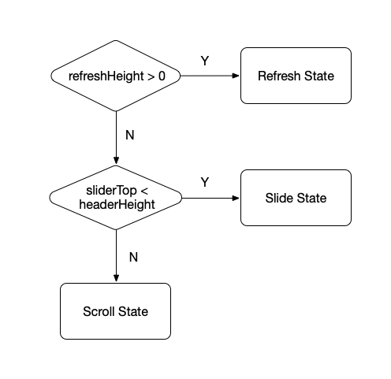

### SlideLayout 双列表页面实现

---


即刻5.3版本的时候，随着圈子详情页的内容越来越丰富，之前的 CoordinatorLayout { AppBarLayout + RecyclerView } 结构已经不能满足我们的需求，需要一个新的布局方案承载各种圈子元素并满足我们的自定义交互操作。

##### 改版前

之前的结构比较简单，头部显示圈子的基本信息比如图片、标题和简介等信息，底部展示圈子内的消息列表，向上滑动可折叠头部区域让用户更加专注地浏览消息feed。实现采用 CoordinatorLayout { AppBarLayout + RecyclerView } 的组合，CoordinatorLayout 作为容器负责两区域的布局和联动滑动，AppBarLayout 负责展示头部信息，RecyclerView 展示消息列表。

这个组合是嵌套滚动的典型应用场景，RecyclerView 实现 NestedScrollingChild 接口，CoordinatorLayout 实现 NestedScrollingParent 接口，CoordinatorLayout 再通过 CoordinatorLayout.Behavior 类将 Child 分发的一系列滚动事件转接给 AppBarLayout，由此实现 AppBarLayout 和 RecyclerView 的联动滚动效果。在这个场景中 CoordinatorLayout 通过代理的方式间接让 AppBarLayout 实现了 NestedScrollingParent 接口，以此突破了 NestedScrollingParent 必须是 NestedScrollingChild 祖先 View 的限制，是个不错的思路。

##### 遇到的问题

之前版本由于圈子信息简单，这套架构已经可以满足我们的需求。但是当圈子引入了插件、成员、置顶等部分时，头部变得越来越长，完全展开会严重影响用户消费消息列表，所以我们需要有个功能可以快速地在头部和列表之间切换，而且由于头部信息可能超过一屏，所以头部也需要可以滑动。总结一下我们对新版圈子详情页的需求：

1. 头部不到一屏时和原来实现保持一致，头部随列表滑动可以折叠。
2. 头部超过一屏时可以滑动，并且可以快速切换到列表区域。

##### 解决方案

第一条好解决，只要按照原来的实现来就行了。问题是第二种情况，当头部超过一屏时如何在头部还没有滑到底时快速显示列表，我们这里的解决方案是通过手势操作将列表区域从底部向上滑动盖在头部上面，当又需要查看头部区域时再通过手势将列表滑下，列表就像一张纸一样从底部滑出/滑进。根据这个方案的工作原理，将新的组件命名为 **SlideLayout**，意思就是处理滑动的 layout。

##### 思路详述

由我们的需求可知有大量复杂的多 View 联动交互，所以 SlideLayout 也需要像 CoordinatorLayout 那样通过 Android 的嵌套滚动机制实现。在 SlideLayout 中总共有三个子 View：refresh、header 和 slider。当用户下拉刷新页面时 refresh 负责展示加载动画；header 属于页面头部区域，需要包含实现了 NestedScrollingChild  的 View 从而向 SlideLayout 分发滚动事件；slider 属于列表区域，也需要包含实现了 NestedScrollingChild 的 View，原因同 header。实现 NestedScrollingChild 的 View 一般是 NestedScrollView RecyclerView，就圈子详情页这个场景来说，NestedScrollView 实现了页面头部，RecyclerView 实现消息列表区域。当然你也可以使用别的实现了该接口的View。

前面说到这个页面有两种情况：header 没超过屏幕高度和超过屏幕高度。没超过屏幕高度时，由于 Slider 不能盖在 Header 上面，只能和 Header 处于一种连接的状态，没有重叠。而当 Header 高度超过屏幕高度时，由于 Slider 可以盖在 Header 上面，所以存在两种状态，一是前面说的连接不重叠即 Header 的 bottom 挨着 Slider 的 top，二即是 Slider 盖在 Header 上面的状态。这里我们将连接不重叠的状态称之为 Scroll，将 Slider 盖在 Header 上面的状态称之为 Slide 状态，加上下拉刷新一共有三个状态，我们这里用一个枚举类型来表示当前的状态：

``` kotlin
enum class SlideGesture { SCROLL, SLIDE, REFRESH }
```

Scroll 状态需要和之前使用 CoordinatorLayout { AppBarLayout + RecyclerView } 保持一致，即头部根据列表的滚动而滚动。Slide 状态的工作主要就是将 slider 滑出或者收起来。最后一个状态负责展示刷新动画。这三个状态是互斥的，处于某一状态时不能进行另外两个状态的操作。

下面通过图示分别表示三种状态：

* Scroll


Scroll 状态时 Header 高度有可能没超过屏幕高度，也有可能超过屏幕高度。

* Slide

  

  Slide 状态时 Header 高度一定超过屏幕高度。

  * Refresh

    

    Refresh 状态图示这里只展示从 Scroll 状态转换而来的 Refresh 状态，其实从 Slide 状态也可以进入 Refresh 状态，和上图类似会在 header 上面出现一个刷新动画展示区域，这里就不列出了。

SlideLayout 的实现基本就分为两部分：负责识别当前状态的 StateChecker 和根据当前状态处理滚动操作的 ScrollHandler。

###### StateChecker

根据上面的分析，状态识别的逻辑已经呼之欲出了，因为在 SlideLayout 内部是通过 sliderTop 来决定 Slider 的位置的，通过判断 sliderTop < headerHeight  是否成立来判断是否处于 Slide 状态，否则处于 Scroll 状态。Refresh 状态的判断最简单，只要 refreshHeight > 0 则处于 Refresh 状态。由于可以从 Refresh/Slide 状态进入 Refresh 状态，所以实践上先判断 Refresh 然后再判断 Scroll 和 Slide，具体流程如下：



###### ScrollHandler

针对不同 state，对滚动事件定义了不同的处理规则，从而实现我们需要的交互效果。具体的处理逻辑见下表：

| x: state, y: scrollType | refresh                                                      | scroll                                                  | slide                                                   |
| ----------------------- | ------------------------------------------------------------ | ------------------------------------------------------- | ------------------------------------------------------- |
| nestedPreScroll         | scrollUp: 消费滚动事件，折叠 refresh；scrollDown: 不消费     | scrollUp: 消费滚动事件，折叠 header；scrollDown: 不消费 | scrollUp: 消费滚动事件，展开 slider；scrollDown: 不消费 |
| nestedScroll            | scrollUp: 不消费；scrollDown: 消费滚动事件，展开 refresh 区域 | scrollUp: 不消费；scrollDown: 消费滚动事件，展开 header | scrollUp: 不消费；scrollDown: 消费滚动事件，折叠 slider |

横向表示三种状态，竖向表示两种 NestedScrollingChild 分发的滚动事件，组合出六种不同的 case。这里给出的逻辑处理比较简单，实际代码实现时会遇到很多需要特殊处理的情况这里就不一一列出了，感兴趣的同学可以查看项目源码，项目地址会在最后给出。

##### 使用实例

页面布局结构如下：

``` xml
<io.iftech.android.library.slide.SlideLayout>
    <!-- header -->
    <io.iftech.android.library.slide.MinVerticalMarginFrameLayout>
        <androidx.core.widget.NestedScrollView>
            <!-- header content here -->
        </androidx.core.widget.NestedScrollView>
    </io.iftech.android.library.slide.MinVerticalMarginFrameLayout>
    <!-- slider -->
    <io.iftech.android.library.slide.MinVerticalMarginFrameLayout>
        <LinearLayout>
            <io.iftech.android.library.slide.SlideBarLayout>
                <!-- slide bar content here -->
            </io.iftech.android.library.slide.SlideBarLayout>
            <androidx.recyclerview.widget.RecyclerView/>
        </LinearLayout>
    </io.iftech.android.library.slide.MinVerticalMarginFrameLayout>
    <!-- refresh -->
    <io.iftech.android.library.refresh.RefreshViewLayout/>
</io.iftech.android.library.slide.SlideLayout>
```

代码中需要指定 SlideLayout 结构中 Header 和 Slider 中各自实现 NestedScrollingChild 接口的 View。具体方法如下:

``` kotlin
headerNestedScrollingChildImplView.configSlideChildTypeHeader()
silderNestedScrollingChildImplView.configSlideChildTypeSlider()
```

除了上面的还有一些配置项需要设置下:

1. Header 最小高度，用于指定当 Header 被折叠时需要显示的高度，这个值一般和 ActionBar 高度一致。

   ``` kotlin
   layHeader.minimumHeight = headerMinHeight
   ```

2. Slider 根据上面设置的 Header 最小值设置最少间距，用来指定 Slider 完全展开时的高度。

   ``` kotlin
   laySlider.setMinVerticalMargin(layHeader.minimumHeight)
   ```

3. SlideLayout 设置 offset，用于指定展示刷新动画的竖向起始位置。

   ``` kotlin
   laySlide.setOffset(layHeader.minimumHeight)
   ```

另外 RefreshViewLayout 只是一个刷新动画容器，并不提供具体的刷新动画实现。使用者可以通过实现 RefreshView 接口创建自定义的刷新动画，并设置给 RefreshViewLayout 的 refreshInterface 来生效。本项目中实现了一个简单的文本刷新动画作为例子以供参考，代码如下:

``` kotlin
layRefresh.refreshInterface = MyRefreshViewImpl(this)
```

SlideLayout 更多的使用方式可以访问 [SlideLayout](https://github.com/tuesda/SlideLayout) 查看。

我们来通过动图来看看实现的效果，第一种是 Header 高度没超过屏幕高度的情况：


然后再看看 Header 高度超过屏幕的情况：


##### 总结

本文主要从 SlideLayout 的设计思路讲解，没有过多地涉及源码。不过我已经将 SlideLayout 实现开源，项目地址：<https://github.com/tuesda/SlideLayout> 如果对 SlideLayout 的具体实现感兴趣可以前去查看，欢迎 **star** 和关注。SlideLayout 组件作为 Android 嵌套滚动机制一种具体实现，在开发的过程中让我深切感受到这套接口功能的强大，接口定义虽然简单，但却几乎能实现各种页面联动效果。除了本文讲的这个实现外，大家还可以看一下我的另外一篇文章 [三级 NestedScroll 嵌套滚动实践](https://zhuanlan.zhihu.com/p/56582475) 从另一种思路通过嵌套滚动机制实现了一个复杂的页面交互效果。由于本人水平有限，文章或者代码如果有任何问题实属难免，欢迎评论指正或者提 issue。


