### SlideLayout 双列表页面实现

---

即刻 5.3 版本的时候，随着圈子详情页的内容越来越丰富，之前的页面结构已经不能满足我们的需求，需要一个新的布局方案承载各种圈子元素并满足我们的自定义交互。

##### 改版前

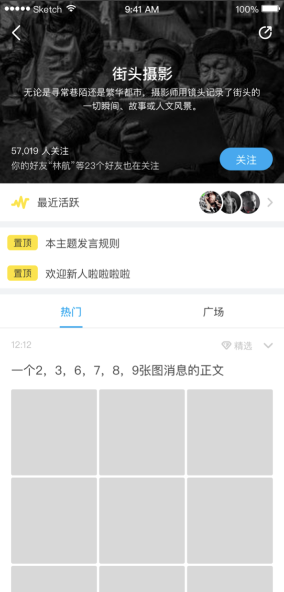

改版前的结构比较简单，头部显示圈子的基本信息比如图片、标题和简介等信息，底部展示圈子内的消息列表，向上滑动可折叠头部区域让用户更加专注地浏览消息列表，结构如下：

* CoordinatorLayout
  * AppBarLayout
  * ViewPager
    * Fragment
      * RecyclerView
    * Fragment
      * RecyclerView

CoordinatorLayout 作为容器负责两部分的布局和联动滑动，AppBarLayout 负责展示头部信息，底部通过 ViewPager 和 Fragment 实现多 tab 页面，Fragment 内部通过 RecyclerView 实现消息列表。

##### 改版后

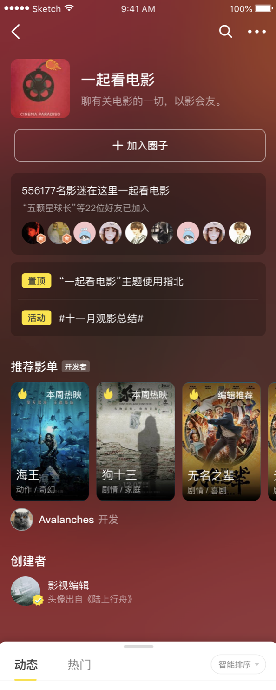

改版后头部新增了一些元素比如插件、创建者，原有的元素展示区域扩大，导致头部高度增大。使得用户刚进入圈子页时几乎看不到消息列表区域，为了解决这个问题我们需要页面支持快速地在头部和列表之间切换，并且当头部超过一屏时也可以滑动。简单总结下我们的需求：

1. 当头部信息较少，即没有达到一屏时表现和原有实现一致，头部随列表滑动可以折叠。
2. 当头部信息较多，即超过一屏时除了头部随着列表滑动折叠外，还可以在头部和列表之间快速切换。

##### 解决方案

第一条需求原有的 CoordinatorLayout  就可以支持，问题是第二条中的快速切换如何实现，最终我们的产品同事给出的解决方案如下：

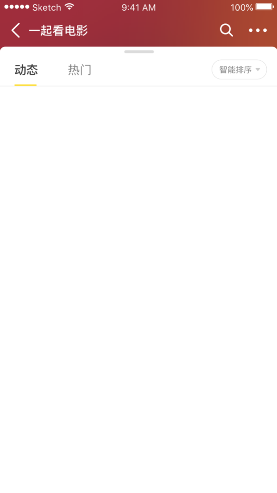

从这个截图看上去好像和原来的将头部折叠一样，其实不然。将头部折叠需要先将头部滑到界面外，而这里头部其实没有滑动，列表是盖在头部上面，当想查看头部时再将列表滑下去。

有人可能会说，这和原来的有什么区别，都需要滑动。这种实现的好处主要有三点：

1. 列表只会存在展开和隐藏两种状态，不会存在显示一半的情况，降低头部和列表切换的难度。
2. 当列表滑动几屏后，此时仍然可以将列表滑出展示头部，不需要将列表滑到最顶部在拉出头部。
3. 当头部很长时，头部内容滑动在任何位置都可以滑出列表，不需要将头部滑到最底部。

原有的 CoordinatorLayout 不能满足上述需求，所以我们需要实现一个自定义组件，由于这个组件的主要功能就是将页面底部滑出滑进，所以我们将这个组件命名为 **SlideLayout**。

##### 思路详述

###### 嵌套滚动

不管是原有逻辑还是新增的，都属于一对嵌套组件的联动交互，不难看出需要用到嵌套滚动机制来实现。首先我们简单了解下嵌套滚动的机制：

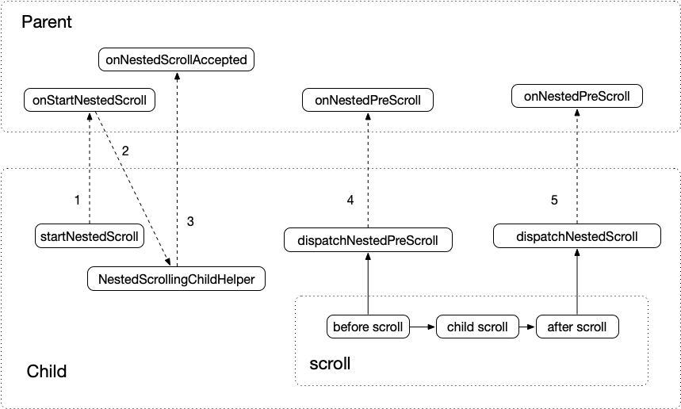

图中 Parent 表示实现了 NestedScrollingParent 接口的组件，Child 表示实现了 NestedScrollingChild 接口的组件，Parent 接受 Child 分发的滚动事件，而且他们不直接关联。

###### SlideLayout 结构

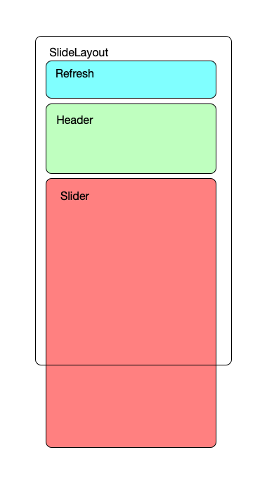

如上图在 SlideLayout 中有三个组件：refresh、header 和 slider，它们的含义如下：

1. refresh：当用户下拉刷新页面时 refresh 负责展示加载动画。
2. header：负责页面头部，需要包含实现 NestedScrollingChild 的组件从而向 SlideLayout 分发滚动事件。
3. slider：负责列表区域，也需要包含实现 NestedScrollingChild 的组件，原因同 header。

实现 NestedScrollingChild 的组件有 NestedScrollView、RecyclerView 等，就圈子详情页这个页面来说，NestedScrollView 实现了页面头部，RecyclerView 实现了消息列表。

###### 操作状态

在处理 SlideLayout 中的滚动事件时，我们用一个枚举类型定义了三个状态：

``` kotlin
enum class SlideGesture { SCROLL, SLIDE, REFRESH }
```

* SCROLL

  slider 和 header 处于连接的状态，即 header 的底边连着 slider 的顶边没有重叠。此状态时需要和老版本保持一致，即头部随着列表的滚动而滚动。如下图:

  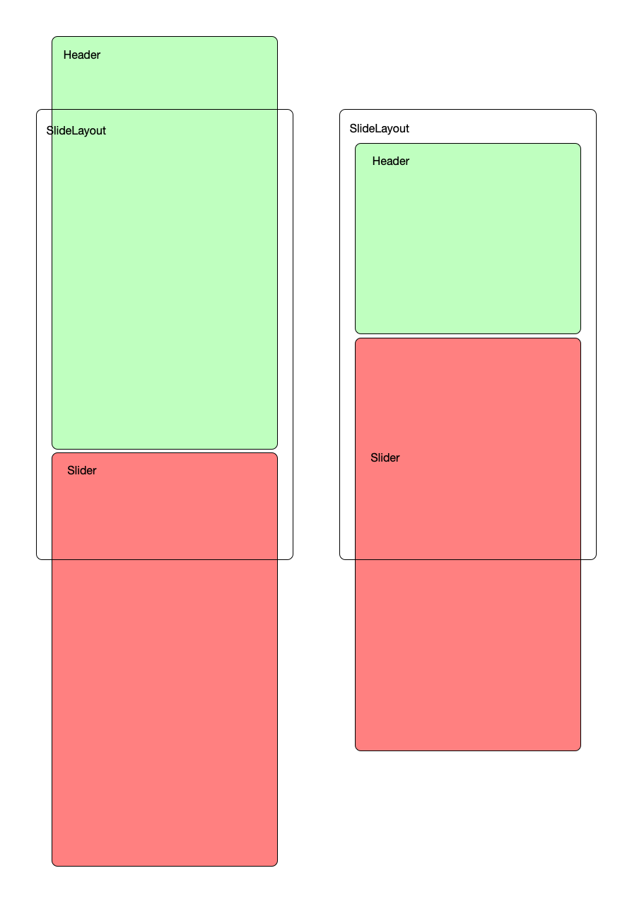

* SLIDE

  slider 盖在 header 上面，slider 此时有可能展示也有可能隐藏，主要工作是将 slider 滑出或者隐藏。如下图：

  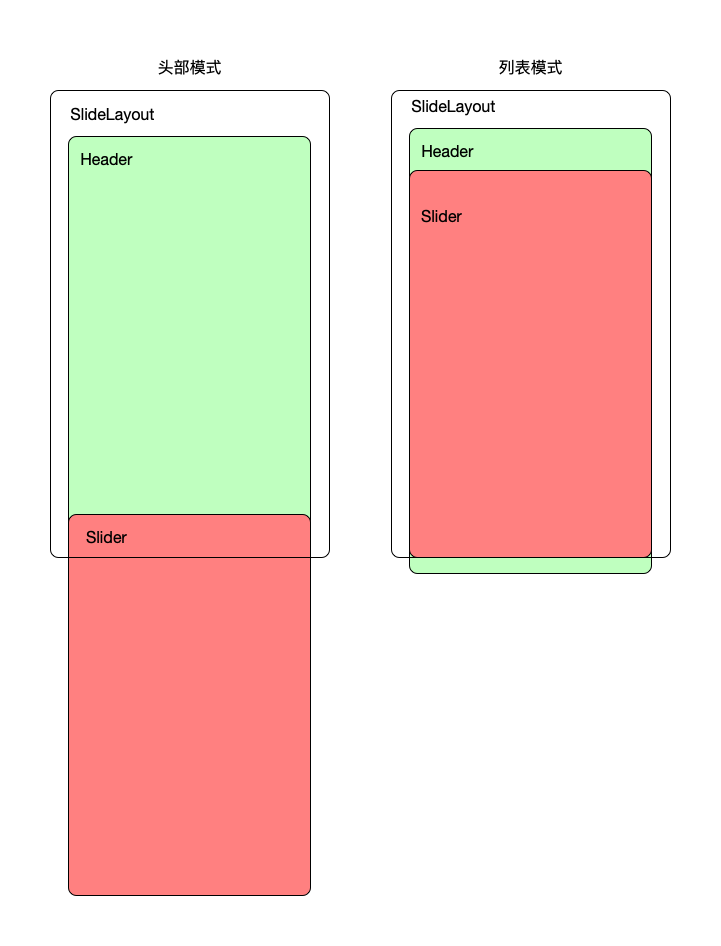

* REFRESH

  展示刷新动画，即刷新动画部分高度大于 0。下图只展示了从 Scroll 状态转换而来的情况，其实从 Slide 状态也可以进入 Refresh 状态，和这个类似会在头部上面出现一个刷新动画展示区域，这里就不列出了。

  

三个状态的彼此转换关系如下图：

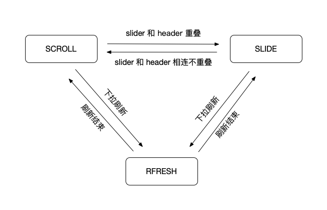

确认了状态定义后剩下的工作基本就分为两部分：状态识别和滚动处理。

###### 状态识别

根据前面讲的状态定义可得出状态判断逻辑如下：

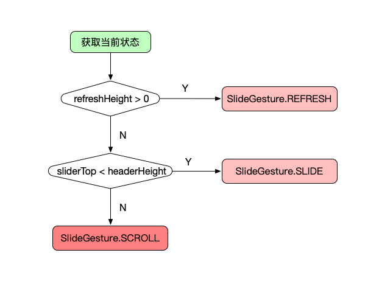

我们将 Refresh 状态的优先级设为最高，先判断刷新区域的高度是否大于 0 来检查是不是 Refresh 状态。由于 Slide 的定义是 slider 和 header 有重叠，而 slider 在 SlideLayout 中是通过 sliderTop 来表示位置的，所以我们可以通过  sliderTop < headerHeight 来判断是不是 Slide 状态。最后两个条件都不满足的话就是 Scroll 状态了。

###### 滚动处理

针对不同状态，对滚动事件定义了不同的处理规则，从而实现我们需要的交互效果。具体的处理逻辑见下表：

| 横向表示状态，竖向表示滚动类型             | Refresh                                                     | Scroll                                             | Slide                                                 |
| ------------------------------------------ | ----------------------------------------------------------- | -------------------------------------------------- | ----------------------------------------------------- |
| nestedPreScroll (分发者消费之前的滚动事件) | 向上滚动: 消费滚动事件，折叠 刷新动画区域；向下滚动: 不消费 | 向上滚动: 消费滚动事件，折叠头部；向下滚动: 不消费 | 向上滚动: 消费滚动事件，展开 slider；向下滚动: 不消费 |
| nestedScroll (分发者消费之后的滚动事件)    | 向上滚动: 不消费；向下滚动: 消费滚动事件，展开刷新动画区域  | 向上滚动: 不消费；向下滚动: 消费滚动事件，展开头部 | 向上滚动: 不消费；向下滚动: 消费滚动事件，折叠 slider |

横向表示三种状态，竖向表示两种滚动事件类型，组合出六种不同的 case。这里给出的逻辑处理比较简单，实际实现时会遇到很多需要特殊处理的情况，这里就不一一列出了，感兴趣的同学可以查看项目源码，项目地址会在最后给出。

##### 使用实例

我们通过动图来看看最终实现的效果，第一种是头部没超过屏幕的情况：

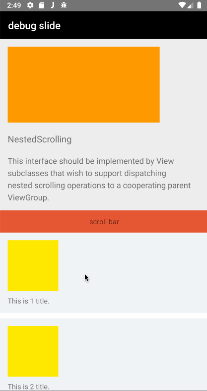

然后再看看头部超过屏幕的情况：

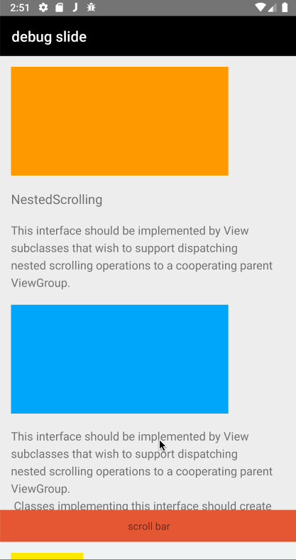

页面布局结构如下：

``` xml
<SlideLayout>
    <!-- header -->
    <MinVerticalMarginFrameLayout>
        <androidx.core.widget.NestedScrollView>
            <!-- header content here -->
        </androidx.core.widget.NestedScrollView>
    </MinVerticalMarginFrameLayout>
    <!-- slider -->
    <MinVerticalMarginFrameLayout>
        <LinearLayout>
            <SlideBarLayout>
                <!-- slide bar content here -->
            </SlideBarLayout>
            <androidx.recyclerview.widget.RecyclerView />
        </LinearLayout>
    </MinVerticalMarginFrameLayout>
    <!-- refresh -->
    <RefreshViewLayout/>
</SlideLayout>
```

- MinVerticalMarginFrameLayout：继承自 FrameLayout 实现的一个简单自定义布局组件，目的是在竖直方向设置最小间距。
- SlideBarLayout：参考 AppBarLayout 实现的滑动条组件，我们开源的项目中有源码，感兴趣的同学可以前去查看。
- RefreshViewLayout：用于存放刷新动画组件的容器，可以通过实现 RefreshView 接口创建自定义的刷新动画，并设置给 RefreshViewLayout 的 refreshInterface 来生效。
- 更多的使用方式可以访问 [SlideLayout](https://github.com/ruguoapp/iftech-android-slide-layout) 项目主页查看。

##### 总结

本文介绍了为什么需要 SlideLayout，并简单阐述了设计思路和实现机制。作为嵌套滚动机制的一种具体实现，在开发过程中让我深切感受到这套接口功能的强大，定义虽然简单，但却几乎能实现各种页面联动效果。希望对读者有所启发和帮助。由于本人水平有限，文章或者代码如果有任何问题实属难免，欢迎评论指正或者提 issue。

SlideLayout 项目地址：https://github.com/ruguoapp/iftech-android-slide-layout 如果对具体实现感兴趣可以前去查看，欢迎 **star** 和关注。

参考文章：

* [三级 NestedScroll 嵌套滚动实践](https://zhuanlan.zhihu.com/p/56582475)
* [NestedScrollingParent2](https://developer.android.com/reference/android/support/v4/view/NestedScrollingParent2)
* [NestedScrollingChild2](https://developer.android.com/reference/android/support/v4/view/NestedScrollingChild2)


