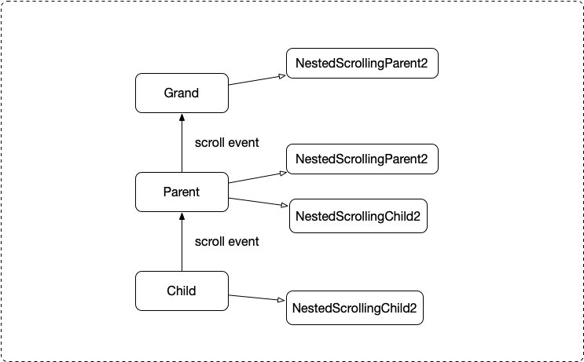
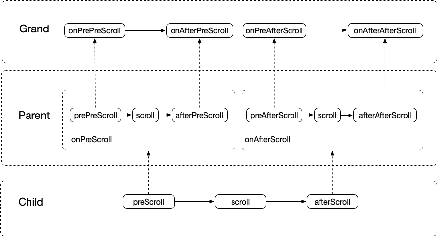

### 三级 NestedScroll 嵌套滚动实践

#### 嵌套滚动介绍

我们知道 NestedScrolling(Parent/Child) 这对接口是用来实现嵌套滚动的，一般实现这对接口的 Parent 和 Child 没有直接嵌套，否则直接用 onInterceptTouchEvent() 和 onTouchEvent() 这对方法实现就可以了。能够越级嵌套滚动正是它的厉害之处。

嵌套滚动的接口有两对：NestedScrolling(Parent/Child) 和 NestedScrolling(Parent2/Child2) 后者相比前者对 fling 的处理更加细致。相比第一代 Child 简单地将 fling 抛给 Parent，第二代 Child 将 fling 转化为 scroll 后再分发给 Parent，为了和普通的 scroll 区分增加了一个参数 type, 当 type 是 ViewCompat.TYPE_TOUCH 时表示普通的 scroll，当是 ViewCompat.TYPE\_NON\_TOUCH 时表示由 fling 转化而来的 scroll。这样做的好处是当 Child 检测到一个 fling 时，它可以选择将这个 fling 引起的 scroll 一部分作用在 Parent 上一部分作用在自己身上，而不是只作用在 Parent 或者 Child 上。或许你会问 fling 为什么不能选择 Parent 和 Child 都作用，事实上你可以，但 fling 的话 Parent 没法告诉 Child 消费了多少，剩下多少，因为 fling 传递的值是速度，不像 scroll 是距离。所以通过 NestedScrolling(Parent2/Child2) 实现嵌套滚动时，当你触发了一个 fling 时，也可以做很顺滑连贯的交替滚动，而 1 就很难达到相同的效果。现在官方 View 的实现也是通过 NestedScrolling(Parent2/Child2)，所以我们在实现自定义的嵌套滚动时尽量用 2。

上面简单介绍了 NestedScrolling 2 和 1 的区别以及为什么要使用2。现在我们来看看 NestedScrolling(Parent2/Child2) 的方法，1 就不看了，和 2 差不多。

``` java
public interface NestedScrollingChild2 {

    void setNestedScrollingEnabled(boolean enabled);

    boolean isNestedScrollingEnabled();

    boolean startNestedScroll(@ScrollAxis int axes, @NestedScrollType int type);
    
    void stopNestedScroll(@NestedScrollType int type);

    boolean hasNestedScrollingParent(@NestedScrollType int type);

    boolean dispatchNestedScroll(int dxConsumed, int dyConsumed,
            int dxUnconsumed, int dyUnconsumed, @Nullable int[] offsetInWindow,
            @NestedScrollType int type);
            
	boolean dispatchNestedPreScroll(int dx, int dy, @Nullable int[] consumed,
            @Nullable int[] offsetInWindow, @NestedScrollType int type);
}
```

```java
public interface NestedScrollingParent2 {

	boolean onStartNestedScroll(@NonNull View child, @NonNull View target, @ScrollAxis int axes,
            @NestedScrollType int type);
            
	void onNestedScrollAccepted(@NonNull View child, @NonNull View target, @ScrollAxis int axes,
            @NestedScrollType int type);
            
	void onStopNestedScroll(@NonNull View target, @NestedScrollType int type);

	void onNestedScroll(@NonNull View target, int dxConsumed, int dyConsumed,
            int dxUnconsumed, int dyUnconsumed, @NestedScrollType int type);

	void onNestedPreScroll(@NonNull View target, int dx, int dy, @NonNull int[] consumed,
            @NestedScrollType int type);
}
```

从这两个接口的方法可以看出这些方法都是一一对应的，比如 startNestedScroll 和 onStartNestedScroll，stopNestedScroll 和 onStopNestedScroll 等。从这些方法的命名上也能看出来嵌套滚动的交互顺序是 Child 主动触发，Parent 被动接受，所以决定是否打开嵌套滚动的方法 setNestedScrollingEnabled 由 Child 实现，决定开始和结束的方法 startNestedScroll 和 stopNestedScroll 也由 Child 实现。

这里用一个图来表示嵌套滚动流程


整个过程大概分为两部分：绑定和滚动分发。绑定部分可以理解为 Child 向上遍历找 NestedScrollingParent2 的过程，找到后调用它的 onStartNestedScroll 方法，如果返回 true 则说明这个 Parent 想接收 nested scroll，Child 会紧接着调 onNestedScrollAccepted 方法表示同意 Parent 处理自己分发的 nested scroll，对应上图中的 1 2 3。滚动分发部分 Child 将自己的 scroll 分为三个阶段 before scroll after，before 和 after 分发给 parent 消费，scroll 阶段让自己消费，这三个阶段是按顺序进行的，换句话说如果前一步消耗完了 scroll，那后面的阶段就没有 scroll 可以消费。这样做的好处是让 Parent 可以在自己消费之前或者之后消费 scroll，如果 Parent 想在 Child 之前消费就在 onNestedPreScroll 方法里处理，否则就在 onNestedScroll 方法里，对应上图中的 4 5 步。上面介绍到的一些通用逻辑被封装在 NestedScrollingChildHelper 和 NestedScrollingParentHelper 中，在 NestedScrolling(Parent2/Child2) 的方法中可以调用 Helper 类中的同名方法，比如 NestedScrollingChild2.startNestedScroll 方法中实现了向上遍历寻找 NestedScrollingParent 的逻辑。

#### 三级嵌套滚动

一个常见的嵌套滚动例子是 CoordinatorLayout/AppbarLayout - RecyclerView, 实现的效果是向上滑动列表时，会先将 AppbarLayout 向上滑动直到完全折叠，向下滑动至列表最顶部后会展开 AppbarLayout, 如下图：


这里实现 NestedScrollingParent2 的是 CoordinatorLayout/AppbarLayout, 实现 NestedScrollingChild2 的是 RecyclerView。对于这种两级嵌套滚动的需求使用 CoordinatorLayout 几乎都能实现，如果遇到特殊的业务需求基于 CoordinatorLayout 和 RecyclerView 的实现改改也能实现。


我这里遇到的需求是即刻首页的样式(可参考即刻5.4.2版本)，除了要有 AppbarLayout 折叠效果之外还要在 AppbarLayout 顶部展示搜索框和刷新动画。这里的滑动逻辑是：

1. 向上滑动时，最先折叠刷新动画，向下滑动时最后展开刷新动画。
2. 向上滑动列表时先折叠 AppbarLayout，AppbarLayout 完全折叠后再折叠搜索框。
3. 向下滑动列表时在展开 AppbarLayout 之前先展开搜索框。
4. 列表没滑动到顶部时可以通过触发一定速度的向下 fling 来展开搜索框。

可以发现这里除了 CoordinatorLayout/AppbarLayout - RecyclerView 这对嵌套滚动的 Parent 和 Child 之外还多了搜索框和刷新动画，而这三者之间的滑动逻辑需要通过嵌套滚动实现，只是传统的两级嵌套滚动不能满足，所以需要实现三级嵌套滚动。

所谓三级嵌套滚动是在两级嵌套滚动之上再添加一个 Parent，这里为了表述方便将三级嵌套滚动的三级由上到下分别称为 Grand Parent Child。具体是由两对 NestedScrolling(Parent2/Child2) 接口实现，Grand 实现第一对接口的 Parent，Parent 实现第一对接口的 Child 和第二对接口的 Parent，Child 实现第二对接口的 Child。与两级嵌套滚动相比三级嵌套的 Grand 和 Child 和两级的 Parent 和 Child 区别不大，变化比较大的是三级的 Parent 既要实现两级的 Parent 接口又要实现 Child 接口，示意图如下:



在即刻首页这个例子里，CoordinatorLayout/AppbarLayout 属于三级嵌套的 Parent 实现了第二对接口的 NestedScrollingParent2，RecyclerView 属于 Child 实现了第二对接口的 NestedScrollingChild2。这里我们需要做的是实现第一对嵌套接口，新建一个自定义 Layout 实现 NestedScrollingParent2 接口作为三级嵌套的 Grand，负责搜索框和刷新动画的折叠和展开。再新建一个自定义 Layout 继承 CoordinatorLayout 实现 NestedScrollingChild2 接口，负责拦截列表分发上来的滚动事件或者处理 AppbarLayout 消费后剩下的滚动事件。

二级嵌套滚动可以理解为给 Parent 提供了拦截 Child 滚动事件和处理 Child 剩余滚动事件的能力，具体逻辑可参考本文最开始介绍嵌套滚动的部分。相应的三级嵌套滚动给 Grand 提供了拦截 Parent 和处理剩余滚动事件的能力，只是拦截和处理的时机多了一些，如下图：



二级嵌套滚动对滚动处理时机只有三个阶段：preScroll、scroll 和 afterScroll。而三级嵌套滚动的处理时机就多一些，有七个阶段：prePreScroll、preScroll、afterPreScroll、scroll、preAfterScroll、afterScroll 和 afterAfterScroll，可以看出相比二级嵌套多了 prePreScroll、afterPreScroll、preAfterScroll 和 afterAfterScroll 这四个阶段，多出的这几个阶段都是给 Grand 用的。到这里可以发现 NestedScrollingParent2 其实不能完全描述 Grand 的能力，确实最理想的方案应该是新建一对接口 NestedScrollingGrand2 和 NestedScrollingGrandChild2 来描述新增的四个对滚动事件的处理阶段，但考虑到我这里的例子 Grand 对 Parent 的处理没有那么精细化，所以还是通过复用 NestedScrolling(Parent2/Child2) 和一些附加方法来实现。以后如果实现了 NestedScrolling(Grand2/GrandChild2) 接口，也会及时更新。根据这个图示即刻首页的滑动实现的思路就很简单了：

1. onPrePreScroll 中执行折叠刷新动画的逻辑，onAfterAfterScroll 中执行展开刷新动画的逻辑。
2. onPreScroll 中执行折叠 AppbarLayout 的逻辑，onAfterPreScroll 中执行搜索框折叠的逻辑。
3. onAfterScroll 中执行展开 AppbarLayout 的逻辑，onPreAfterScroll 中执行搜索框展开的逻辑。
4. 列表没滑到顶部根据 fling 展开搜索框的逻辑单独在 Parent 的 onNestedPreFling 里做，这条算是一个特殊处理。


