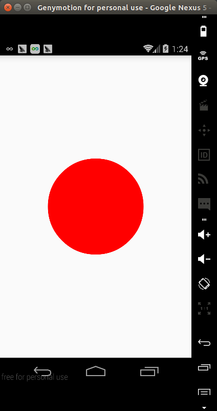
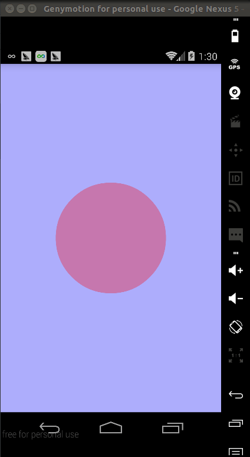
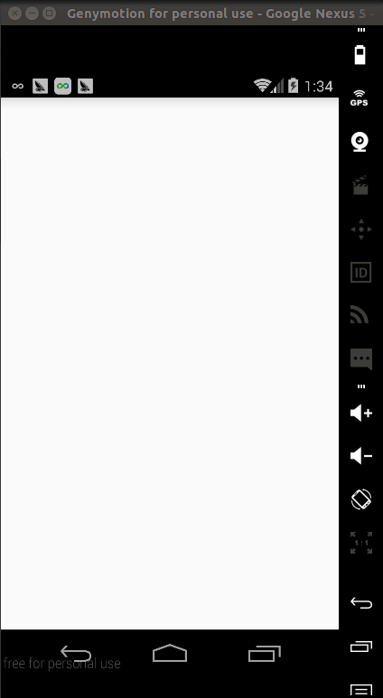

Android上一些动画效果是通过实现自定义的View来实现的。自定义View中比较重要的部分就是在`onDraw(Canvas canvas)`里面实现自己的动画逻辑。想象这么一种场景：在一个已有的颜色A的背景上画一另外一种颜色B的圆形。如下图：  



如果根据时间来改变圆的半径，那就会有一个动画的效果，比如下面这样：


`onDraw()`里面的主要代码是这样的：

```
// 画一个背景
canvas.drawRect(0, 0, getWidth(), getHeight(), mBgPaint);
// 计算每一个时刻圆的半径，mAnimtor.getAnimtedFraction()会根据时间从0 - 1
int curRadius = (int) (mMaxRadius * mAnimator.getAnimatedFraction());
// 画半径为curRadius的圆圈
canvas.drawCircle(getWidth() / 2, getHeight() / 2, curRadius, mPaint);
// 如果动画没结束，就继续调用invalide(),这样会重复调用这个onDraw()方法，让我们可以画下一时刻的圆圈
if (mAnimator.isRunning()) {
	invalidate();
}
```

上面的思路是比较简单的，总体上来说就是圆圈盖在矩形背景的上面，通过不断改变圆圈的半径来实现动画的效果。  

不过当背景矩形颜色和矩形颜色是半透明的就会导致问题，像下面这样：  



现在看到的圆圈颜色其实不是我们制定的颜色，而是圆圈本身的颜色和后面矩形背景颜色的叠加，之前没有这个问题，是因为这两种颜色都不是半透明，圆圈的颜色会完全遮住后面背景的颜色。如果去掉背景，我们可以看到圆圈本来的颜色，想下面这样：



那当背景色和上面圆圈的颜色是半透明的时候，有什么办法来避免这种情况呢？