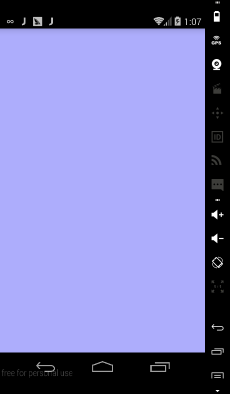

Android上一些动画效果是通过实现自定义的View来实现的。自定义View中比较重要的部分就是在`onDraw(Canvas canvas)`里面实现自己的动画逻辑。想象这么一种场景：在一个已有的颜色A的背景上画一另外一种颜色B的圆形。如下图：  


如果根据时间来改变圆的半径，那就会有一个动画的效果，比如下面这样：


`onDraw()`里面的主要代码是这样的：

```
// 画一个背景
canvas.drawRect(0, 0, getWidth(), getHeight(), mBgPaint);
// 计算每一个时刻圆的半径，mAnimtor.getAnimtedFraction()会根据时间从0 - 1
int curRadius = (int) (mMaxRadius * mAnimator.getAnimatedFraction());
// 画半径为curRadius的圆圈
canvas.drawCircle(getWidth() / 2, getHeight() / 2, curRadius, mPaint);
// 如果动画没结束，就继续调用invalide(),这样会重复调用这个onDraw()方法，让我们可以画下一时刻的圆圈
if (mAnimator.isRunning()) {
	invalidate();
}
```

上面的思路是比较简单的，总体上来说就是圆圈盖在矩形背景的上面，通过不断改变圆圈的半径来实现动画的效果。  

不过当背景矩形颜色和矩形颜色是半透明的就会导致问题，像下面这样：  


现在看到的圆圈颜色其实不是我们指定的颜色，而是圆圈本身的颜色和后面矩形背景颜色的叠加，之前没有这个问题，是因为这两种颜色都不是半透明，圆圈的颜色会完全遮住后面背景的颜色。如果去掉背景，我们可以看到圆圈本来的颜色，想下面这样：


那当背景色和上面圆圈的颜色是半透明的时候，有什么办法来避免这种情况呢？

**出现问题的原因是圆圈颜色和背景颜色重叠，那在每次画圆圈的时候，先在背景上需要画的圆圈的区域清除背景颜色，然后再画圆圈就可以解决这个问题。**

根据这个解决方案google了一下可能的解决方案，发现使用PortDuff.Mode.CLEAR可以解决这个问题。这个模式就是清除掉之前的颜色，刚好满足我的需求。

`onDraw()`里面的代码这样写：

```
@Override
    protected void onDraw(Canvas canvas) {
        super.onDraw(canvas);
        canvas.drawRect(0, 0, getWidth(), getHeight(), mBgPaint);

        int curRadius = (int) (mMaxRadius * mAnimator.getAnimatedFraction());
        canvas.drawCircle(getWidth() / 2, getHeight() / 2, curRadius, mClearPaint);
        canvas.drawCircle(getWidth() / 2, getHeight() / 2, curRadius, mPaint);
        if (mAnimator.isRunning()) {
            invalidate();
        }

    }
```


但这样写有一个问题，我们不仅清除掉了自定义View的背景色，连它下面View的颜色也清除掉了，而我们这个Demo里主题是黑色的，所以就看到了window的颜色也就是黑色和圆圈颜色的叠加效果：



出现这样的原因，是因为`onDraw(Canvas canvas)`参数canvas的背景颜色是当前屏幕已有view颜色的叠加，所以当你用`PorterDuff.Mode.CLEAR`就会清除掉下面view的背景色。

那这个问题的解决办法是什么呢？

通过Google，找到解决办法：自己创建一个临时Canvas,每次在这个canvas上完成需要的绘画操作，然后将结果以Bitmap的方式画在`onDraw(Canvas canvas)`提供的的Canvas上面。最终效果如下图：


看这个圆圈颜色是不是和背景是白色的时候一样，说明我们的解决办法有效果。下面贴出最终效果的实现代码：

```
public class CustomView extends View {
    private Paint mBgPaint;
    private Paint mPaint;
    private Paint mClearPaint;

    private Canvas mTmpCanvas;
    private Bitmap mTmpBmp;

    private ValueAnimator mAnimator;
    private int mMaxRadius;

    private boolean mDrawnBg;

    public CustomView(Context context) {
        this(context, null, 0);
    }

    public CustomView(Context context, AttributeSet attrs) {
        this(context, attrs, 0);
    }

    public CustomView(Context context, AttributeSet attrs, int defStyleAttr) {
        super(context, attrs, defStyleAttr);
        init();
    }

    private void init() {
        mBgPaint = new Paint();
        mBgPaint.setColor(Color.parseColor("#4f0000ff"));
        mBgPaint.setAntiAlias(true);

        mPaint = new Paint();
        mPaint.setColor(Color.parseColor("#4fff0000"));
        mPaint.setAntiAlias(true);

        mClearPaint = new Paint();
        mClearPaint.setColor(Color.TRANSPARENT);
        mClearPaint.setXfermode(new PorterDuffXfermode(PorterDuff.Mode.CLEAR));

        mAnimator = ValueAnimator.ofFloat(0, 1f);
        mAnimator.setDuration(1000);


        setOnClickListener(new OnClickListener() {
            @Override
            public void onClick(View v) {
                startAnimator();
            }
        });

    }

    private void startAnimator() {
        mAnimator.start();
        invalidate();
    }

    @Override
    protected void onSizeChanged(int w, int h, int oldw, int oldh) {
        super.onSizeChanged(w, h, oldw, oldh);
        mMaxRadius = Math.min(w, h) / 4;

        // 当View大小变化时,创建mTmpBmp和mTmpCanvas,因为这个两个对象以来View的宽高w和h
        mTmpBmp = Bitmap.createBitmap(w, h, Bitmap.Config.ARGB_8888);
        mTmpCanvas = new Canvas(mTmpBmp);
    }

    @Override
    protected void onDraw(Canvas canvas) {
        super.onDraw(canvas);
        drawTmpCanvas();
        canvas.drawBitmap(mTmpBmp, 0, 0, null);
        if (mAnimator.isRunning()) {
            invalidate();
        }

    }

    private void drawTmpCanvas() {
        if (mTmpCanvas == null) {
            return;
        }

        // 背景颜色只需要画一次
        if (!mDrawnBg) {
            mDrawnBg = true;
            mTmpCanvas.drawRect(0, 0, getWidth(), getHeight(), mBgPaint);
        }

        int curRadius = (int) (mMaxRadius * mAnimator.getAnimatedFraction());
        mTmpCanvas.drawCircle(getWidth() / 2, getHeight() / 2, curRadius, mClearPaint);
        mTmpCanvas.drawCircle(getWidth() / 2, getHeight() / 2, curRadius, mPaint);
    }
}
```