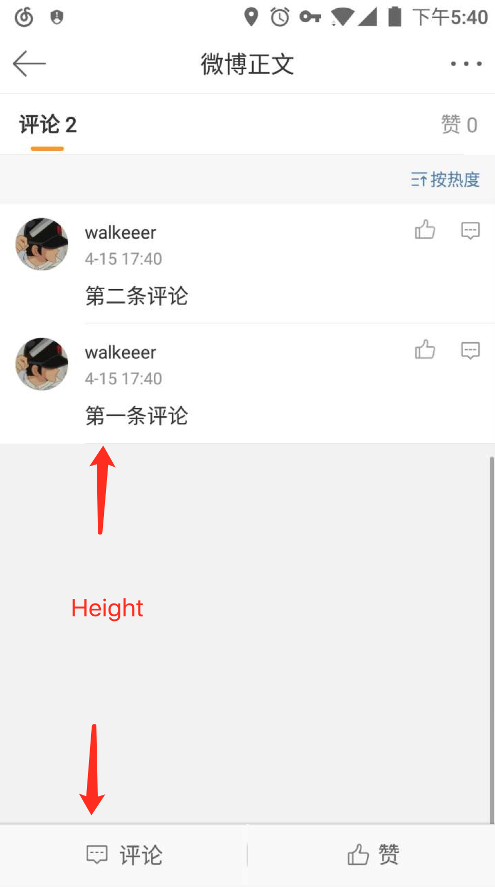

## 如何实现微博评论列表滑动置顶效果

微博评论列表里所有评论的总高度如果没有占满一屏，那么会有一段固定的空白填充在底部，使得滑到最底时最新一条评论刚好置顶，如下图。对于只想看评论列表来说展示效率很高，也符合直觉。我们应用也需要实现这个效果，在这里分享一下实现的两种方法。



这里将评论列表底部空白部分称作 bottom space，评论列表用 RecyclerView 来实现。当评论列表的总高度大于等于 RecyclerView 高度时很简单，bottom space 的高度设为0就好了，问题主要是在评论列表总高度小于 RecyclerView 高度时，如何动态调整 bottom space 的高度。关于这点我们实现的时候先后采取了两种解决方案：

### 第一种

将 bottom space 作为 RecyclerView 的一种 item，插在列表最后一个位置，通过透明的 View 来实现，当评论列表发生增减时动态调整 bottom space 的高度。bottom space 的高度等于 RecyclerView 的高度减去评论列表的总高度。RecyclerView 的高度不难获取，主要是获取评论列表的总高度，因为每一条评论的内容都不一样，所以需要单独获取每条评论的高度然后相加。RecyclerView 没有提供获取 itemView 高度的接口，并且由于实现机制原因 itemView 在渲染出来之前是无法知道它的高度的。所以采取的办法是当评论列表数据刷新时记一个标志位 `mNeedAdjustBottomSpace` 表示需要调整 bottom space 高度。然后在页面滑动时，当页面内 item type 都是评论时就可以去根据评论列表总高度调整 bottom space 的高度。代码片段如下。

```
addScrollListener(new OnScrollListener() {
    public void onScrolled(RecyclerView recyclerView, int dx, int dy) {
        if (mNeedAdjustBottomSpace) {
        	// 页面内都是评论类型
            boolean canAdjust = ((LinearLayoutManager) getLayoutManager()).findFirstVisibleItemPosition() >= getAdapter().getHeaderCount()
                    || !recyclerView.canScrollVertically(1);
            if (canAdjust) {
                mNeedAdjustBottomSpace = false;
                adjustBottomSpace();
            }
        }
});

private void adjustBottomSpace() {
    int normalHeight = getNormalHeight();
    if (normalHeight != 0) {
        int newBottomSpaceHeight = Math.max(getHeight() - normalHeight, 0);
        post(() -> getAdapter().setBottomSpaceHeight(newBottomSpaceHeight));
    }
}

private int getNormalHeight() {
    LinearLayoutManager lm = (LinearLayoutManager) getLayoutManager();
    int result = 0;
    int first = lm.findFirstVisibleItemPosition();
    int end = lm.findLastVisibleItemPosition();
    JAdapter adapter = getAdapter();
    for (int i = Math.max(first, adapter.getHeaderCount());
         i < Math.min(adapter.getItemCount() - adapter.getBottomSpaceCount(), end + 1); i++) {
        View v = lm.findViewByPosition(i);
        if (v != null && BaseAdapter.LOAD_MORE != adapter.getItemViewType(i)) {
            result += v.getHeight();
        }
    }
    return result;
}
```

`getAdapter().setBottomSpaceHeight()` 的实现是通过成员变量记住 bottom space 的高度，调用 `Adapter.notify()` 方法，然后在 `Adapter.onBindViewHolder()` 方法里改变 bottom space itemView 的高度。

这个方案虽然基本实现了我们需要的效果，但是还有两个问题：  

1. 只有评论列表刷新时才可以调整 bottom space有局限性，而且调整的时机判断有点 hack，不利于代码维护。
2. 会在 RecyclerView 滑动过程中调用 Adapter notify方法，容易导致 RecyclerView inconsistent crash。

### 第二种

如果要解决第一种方案的问题，将 bottom space 作为一种 itemView 来实现这条路肯定走不通了。需要实现的效果换个思路想就是当滑动到最后一条评论时，让 RecyclerView 认为还没有滑到底，通过查看 RecyclerView 的代码发现在 `onTouchEvent()` 方法中对 `MotionEvent.ACTION_MOVE` 的处理有这么一段代码：

```
if (scrollByInternal(canScrollHorizontally ? dx : 0, canScrollVertically ? dy : 0,vtev)) {
	getParent().requestDisallowInterceptTouchEvent(true);
}
```

这说明 `scrollByInternal()` 这个方法的返回值决定 RecyclerView 能不能继续往下滑动，继续查看这个方法发现了这行代码：

```
consumedY = mLayout.scrollVerticallyBy(y, mRecycler, mState)
```

当竖直方向滑动时 `consumedY != 0` 说明还可以继续往下滑动，按照这个变量的字面意思 `mLayout.scrollVerticallyBy()` 返回的是 LayoutManager 竖直滑动过的距离。继续查看 LinearLayoutManager.scrollVerticallyBy() 方法发现是在 layoutChunk() 里计算滑动过的距离，这个方法最关键的代码其实只有两行：

```
measureChildWithMargins(view, 0, 0);
result.mConsumed = mOrientationHelper.getDecoratedMeasurement(view);
```

mOrientationHelper.getDecoratedMeasurement(view) 里面实现很简单：

```
@Override
public int getDecoratedMeasurement(View view) {
    final RecyclerView.LayoutParams params = (RecyclerView.LayoutParams) view.getLayoutParams();
    return mLayoutManager.getDecoratedMeasuredHeight(view) + params.topMargin + params.bottomMargin;
}
```

发现可以滑动的距离等于进入页面的 itemView 的高度加上 marginTop 和 marginBottom 的大小。所以要实现我们需要的效果只要将评论列表最后一个 itemView 的 marginBottom 看作 bottom space 就可以了。因为必须在 mOrientationHelper.getDecoratedMeasurement(view) 之前设置 marginBottom，所以选择在 measureChildWithMargins(view, 0, 0) 中设置。而且在这个方法里也可以获取每个 itemView 的高度，正好计算所有评论 itemView 的高度和。代码如下，重写了 LinearLayoutManager 的 measureChildWithMargins() 方法。

```
new LinearLayoutManager(context, LinearLayoutManager.HORIZONTAL, false) {

    private SparseIntArray mHeightArray = new SparseIntArray();

    @Override
    public void measureChildWithMargins(View child, int widthUsed, int heightUsed) {
        super.measureChildWithMargins(child, widthUsed, heightUsed);
        LayoutParams params = (LayoutParams) child.getLayoutParams();
        int position = params.getViewAdapterPosition();
        JAdapter adapter = getAdapter();
        mHeightArray.put(position, child.getMeasuredHeight());
        int bottomMargin = 0;
        if (position == adapter.getItemCount() - 1) {
            bottomMargin = getHeight();
            for (int i = 0; i < mHeightArray.size(); i++) {
                int key = mHeightArray.keyAt(i);
                if (key >= adapter.getHeaderCount() && key < adapter.getItemCount()) {
                    int value = mHeightArray.get(key);
                    bottomMargin = Math.max(0, bottomMargin - value);
                    if (bottomMargin == 0) {
                        break;
                    }
                }
            }
        }
        params.bottomMargin = bottomMargin;
    }
};
```
在这个方法里将每个 itemView 的高度存在 mHeightArray 内，当 itemView 是最后一个时，用 RecyclerView 的高度减去所有评论 itemView 的总高度得到 bottom space 的高度并设为最后一个 itemView 的 bottomMargin。这样就可以实现评论置顶的效果，并且在增减评论时都有效，而不局限刷新列表数据时。实现比第一种简单很多，而且容易维护。